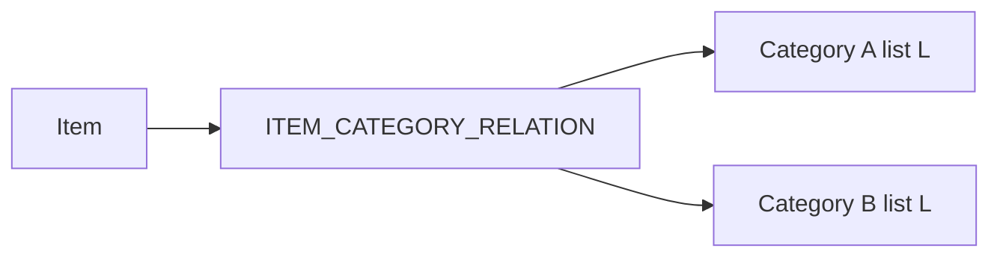

# One category per item per list (parked)

**Status: parked — do not implement yet.**

Originally scoped as a repair transform plus schema/API enforcement so an item could belong to at most one category on a given shopping list. That approach assumed multi-category membership on a list is always a bug.

## Why this is paused

In practice, the same item on one list may correctly belong under **different categories depending on store/location** (aisle layout differs by store). Today:

- Categories are **list-scoped only** (`CATEGORY.LIST_ID`) — not location-dependent.
- **Category display order** is already location-scoped (`CATEGORY_ORDER` / `LOCATION_ID`), but **which category an item sits in** is not.
- Many category names are shared across locations, but not all.
- There is no model for “item → category **at location X**.”

Enforcing `UNIQUE (ITEM_ID, LIST_ID)` on category membership would force a single category per item per list and erase legitimate location-specific placements. That asymmetry (order per location, membership global-per-list) is the core design gap.

A clean fix likely needs product/data-model work first, for example:

- Location-scoped categories, or
- Location-scoped item↔category placement (while keeping shared category definitions), or
- Explicit “default category” vs “per-location override”

Until that design exists, leave multi-category-per-list as-is and treat odd UI cases as known limitations.

---

## Earlier plan (reference only)

The sections below are the approach that was agreed before the location insight. Keep for when revisiting; do not ship as-is without resolving location semantics.

### Problem (as originally framed)

`ITEM_CATEGORY_RELATION` is keyed only by `(ITEM_ID, CATEGORY_ID)`. Categories are list-scoped via `CATEGORY.LIST_ID`, so the same item can sit in multiple categories on one list. Add-to-category currently only `INSERT IGNORE`s; it never clears other same-list links.



### Decisions that had been locked

- **Repair:** review JSON (generate → edit `keep_category_id` → apply). Each conflict includes category **id + name** (and list/item context) so you can choose.
- **Prevention:** API move semantics **and** schema: denormalize `LIST_ID` onto `ITEM_CATEGORY_RELATION` with `UNIQUE (ITEM_ID, LIST_ID)`.

### 1. Schema (deferred)

Update `schema/setup.sql` `ITEM_CATEGORY_RELATION` and add idempotent `schema/migrations/007_item_category_list_unique.sql`:

- Add `LIST_ID binary(16) NOT NULL` (FK → `LIST`, `ON DELETE CASCADE`)
- Backfill from `CATEGORY.LIST_ID`
- Add `UNIQUE KEY uq_item_category_item_list (ITEM_ID, LIST_ID)`
- Keep existing PK `(ITEM_ID, CATEGORY_ID)`

Only safe after data is repaired **and** product rules say one category per item per list is correct (which location-aware shopping may contradict).

### 2. Repair transform (deferred)

Mirror casing/dedupe under `scripts/` + `schema/item-transforms/`:

| Piece | Role |
|-------|------|
| `item-category-dedupe-generate.js` | Find `(item_id, list_id)` with `COUNT(*) > 1`; write `category-membership.{local\|prod}.json` |
| `item-category-dedupe-apply.js` | For `apply: true` rows, delete ICR links for that item on that list except `keep_category_id` |
| npm scripts | `item-category-dedupe:generate` / `:apply` |

Review row shape (approx):

```json
{
  "apply": true,
  "item_id": "…",
  "item_name": "Milk",
  "list_id": "…",
  "list_name": "…",
  "keep_category_id": "…",
  "categories": [
    { "id": "…", "name": "Dairy" },
    { "id": "…", "name": "Produce" }
  ]
}
```

### 3. API write paths (deferred)

Update `src/v3/categories/sql/addItem.sql` and `src/v2/categories/sql/addItem.sql` to delete other same-list ICR rows before insert (reassign = move), and populate `LIST_ID` on all ICR writers (`repointItemOnList`, `item-dedupe-apply`, etc.).

### Open design questions before un-parking

1. Should category membership be `(item, list, location)` or `(item, category)` with categories themselves location-scoped?
2. How should shared categories across stores relate to store-specific ones (same name / merge / alias)?
3. What does the shopping UI show when switching location — remap, hide, or keep multiple links?
4. Is “one category per item per list” ever correct as a hard invariant, or only “one category per item per list **per location**”?
