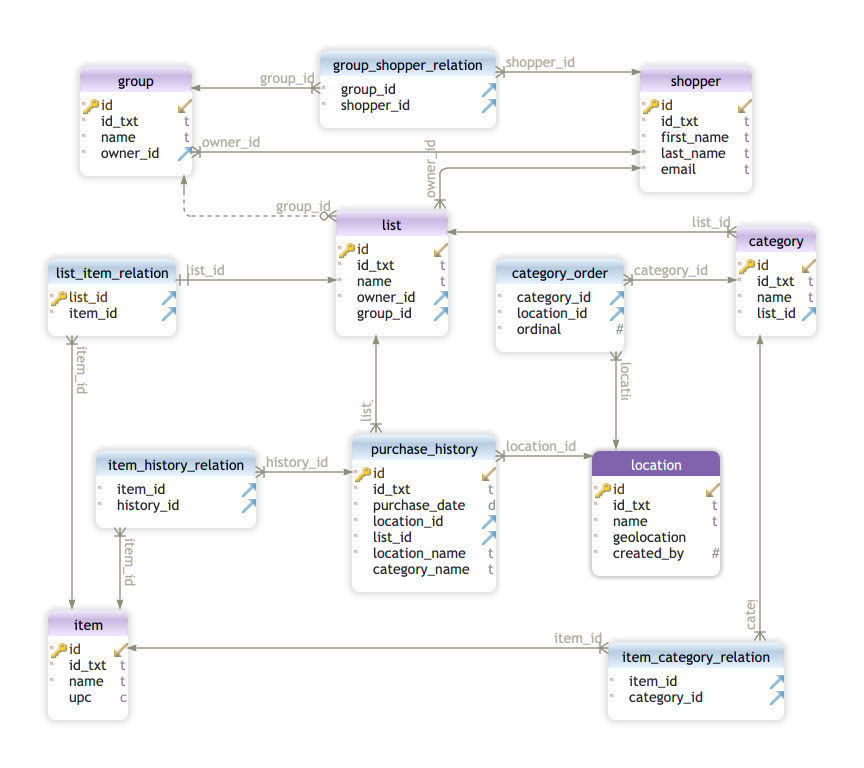

# PANTRY_PLUS database

MySQL schema for the pantryPlus API.

**Compatibility:** the schema is shared by every live API version and must stay **backward compatible**. Do not drop or rename columns/tables that older `/vN` SQL still uses. Breaking changes belong in a new **API** version paired with a matching mobile app release — not in destructive DDL. See [API Versioning](../docs/API_VERSIONING.md) and [Groups & Data Model](../docs/GROUPS_AND_DATA_MODEL.md).

[DbSchema](https://dbschema.com/) was used to design tables and relationships.

## Diagram



## Files

| File | Purpose |
| --- | --- |
| [setup.sql](./setup.sql) | Full **current** schema for **new** databases only |
| [migrations/](./migrations/) | Incremental DDL for **existing** databases only |
| [item-dedupe/](./item-dedupe/) | Reviewed ITEM merge: generate mapping, edit, apply (not migrate) |
| [dropAll.sql](./dropAll.sql) | Tear down (use carefully; never run unless explicitly intended) |

## Apply schema (pick one path)

**Never run both** for the same install. `setup.sql` must always reflect the end state of all migrations, so a new database needs only setup.

| Situation | What to run |
| --- | --- |
| **New database** | [setup.sql](./setup.sql) only (create DB first if needed) |
| **Existing database** | `npm run migrate` only (or apply pending `migrations/*.sql` in DataGrip) |

Do **not** re-run `setup.sql` as an upgrade path on a populated database.

```sh
npm run migrate
```

Migrate loads `.env` (`DBHOST`, `DBUSER`, `DBPASSWORD`, `DATABASE`, `DBPORT`, SSL flags), ensures `SCHEMA_MIGRATIONS` exists, and runs any `schema/migrations/*.sql` not yet recorded (lexical order by filename).

Production (`NODE_ENV=production`) expects `certs/rds-ca.pem` (`npm run downloadcerts`).

The API connection `DATABASE` should match (typically `PANTRY_PLUS`).

## Adding a migration

1. Prefer **additive** DDL (nullable columns, new tables/indexes). See [Groups & Data Model](../docs/GROUPS_AND_DATA_MODEL.md).
2. **Update [setup.sql](./setup.sql) in the same change** so a new DB from setup matches an old DB after this migration.
3. Add `schema/migrations/NNN_short_snake_description.sql` (next zero-padded number).
4. Prefer **idempotent** migration DDL (e.g. check `information_schema` before `ADD COLUMN`) so re-runs or partially updated environments do not fail.
5. On each **existing** environment that needs the change: `npm run migrate` or apply the new file in a DB IDE — leave apply to the developer unless they ask the agent to run it.
6. Keep each live API version’s SQL templates correct against the expanded schema.

### Naming

```text
000_schema_migrations.sql
001_add_location_created_by.sql
002_…
```

The filename is the migration id stored in `SCHEMA_MIGRATIONS.ID`. Do not rename applied files.

### Tracking table

`SCHEMA_MIGRATIONS (ID, APPLIED_AT)` records which migration files have run on an **existing** database. Created by `setup.sql` (empty on greenfield), by migration `000_…`, and/or by the migrate script’s bootstrap. New DBs created from `setup.sql` alone do not need rows for historical migrations already baked into setup.
