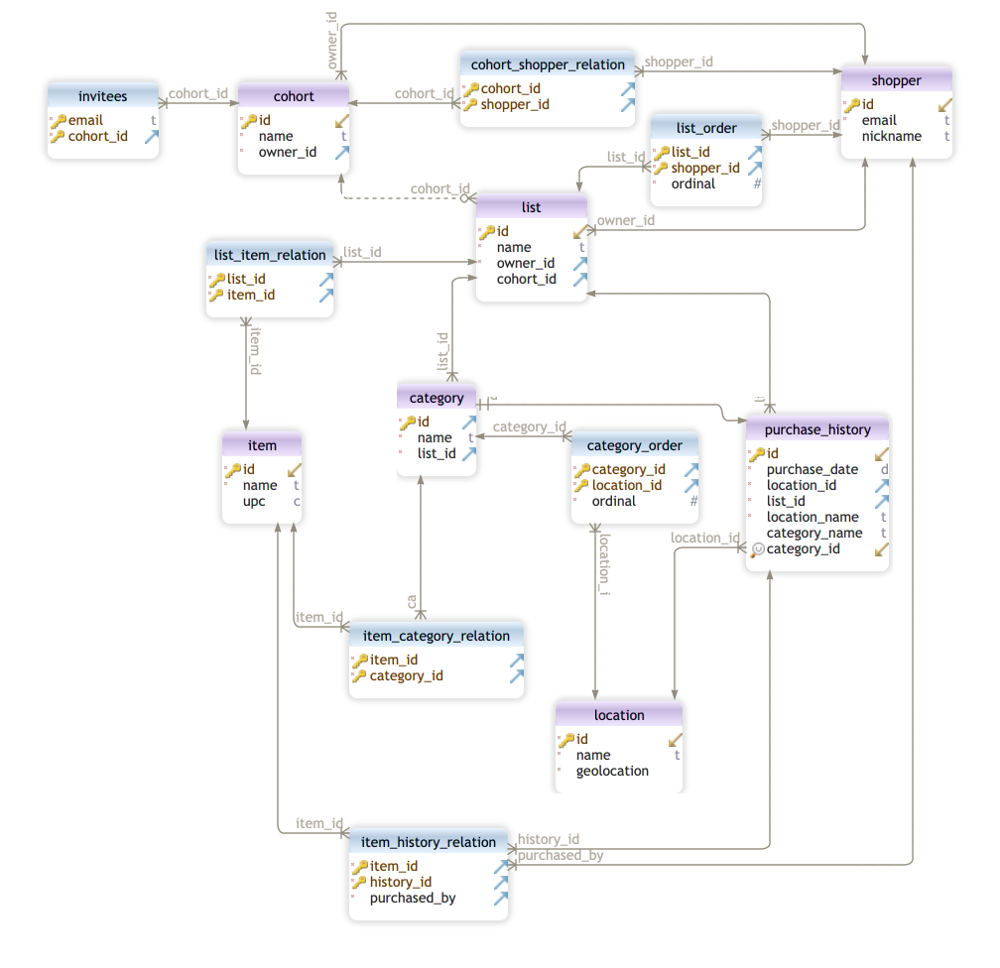

## PANTRY_PLUS DATABASE
The PantryPlus application relies on an API layer built atop a MySQL database.

[DbSchema](https://dbschema.com/) was used to design the database tables and relationships.

## Diagram

